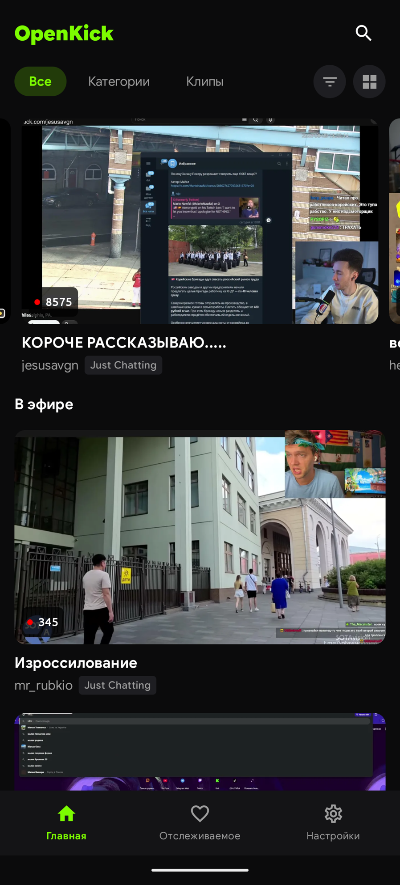
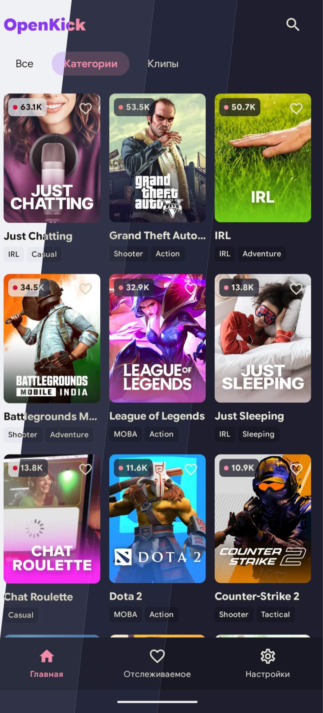

<div align="center">
<br />

</div>

<h1 align="center">OpenKick</h1>

<br />

<h4 align="center">An open-source, lightweight, and fully autonomous Android client for Kick.com.<br>Available in English, Spanish, and Russian.</h4>

<div align="center">
  <a href="https://github.com/Gallbladderz/OpenKick/releases"></a>
  &nbsp;
  <a href="https://apps.obtainium.imranr.dev/redirect?r=obtainium://app/%7B%22id%22%3A%22com.gallbladderz.openkick%22%2C%22url%22%3A%22https%3A%2F%2Fgithub.com%2FGallbladderz%2FOpenKick%22%2C%22author%22%3A%22Gallbladderz%22%2C%22name%22%3A%22OpenKick%22%2C%22additionalSettings%22%3A%22%7B%5C%22appName%5C%22%3A%5C%22OpenKick%5C%22%2C%5C%22appAuthor%5C%22%3A%5C%22Gallbladderz%5C%22%2C%5C%22about%5C%22%3A%5C%22An%20open-source%2C%20lightweight%2C%20and%20fully%20autonomous%20Android%20client%20for%20Kick.com.%5C%22%7D%22%7D"></a>
</div>

<br />

<div align="center">

&nbsp;&nbsp;&nbsp;&nbsp;

</div>

<br />

## ✨ Features

*   **Modern UI:** Built entirely with Jetpack Compose & Material 3, including dynamic colors and beautiful Catppuccin themes.
*   **Feature-Rich Player:** Watch live streams, VODs, and clips seamlessly using ExoPlayer.
*   **Live Chat:** Real-time chat integration to keep up with the community.
*   **Background Playback & PiP:** Keep listening to audio in the background or watch via Picture-in-Picture mode while using other apps.
*   **Local Following System:** Follow your favorite streamers locally without an account, complete with live stream push notifications.
*   **Search & Discover:** Easily browse Kick categories and search for channels, streams, or clips.

> [!NOTE]  
> **Privacy First & Fully Autonomous:** OpenKick operates entirely in autonomous mode. The app does not have an authorization function—you cannot log into your Kick account. All data (like your followed streamers and app settings) is stored securely and locally on your device.

## 🛠️ Build Instructions

Building OpenKick is incredibly simple. There are no API keys or complex setups required.

1. Clone the repository:
   ```bash
   git clone https://github.com/Gallbladderz/OpenKick.git
   ```
2. Open the project in **Android Studio**.
3. Allow Gradle to sync all dependencies.
4. Click **Run** (`Shift + F10`) to build and install the app on your device or emulator.

## 📜 License

This project is open-source and distributed under the **GPL-3.0 License**. See the `LICENSE` file for more details.
